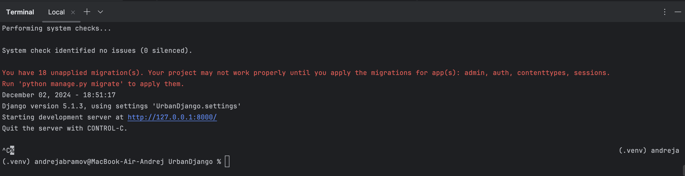
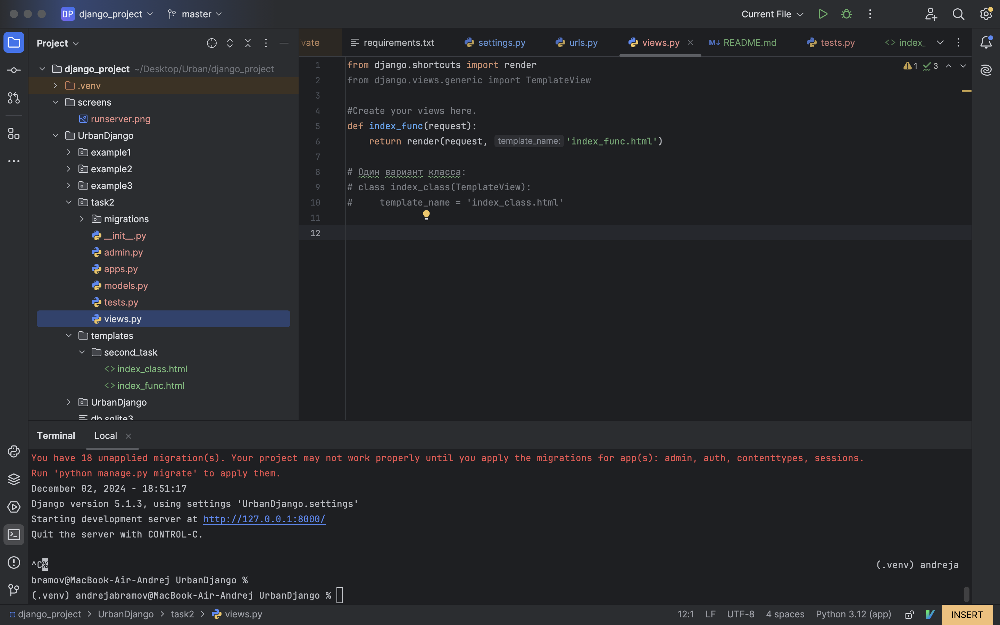
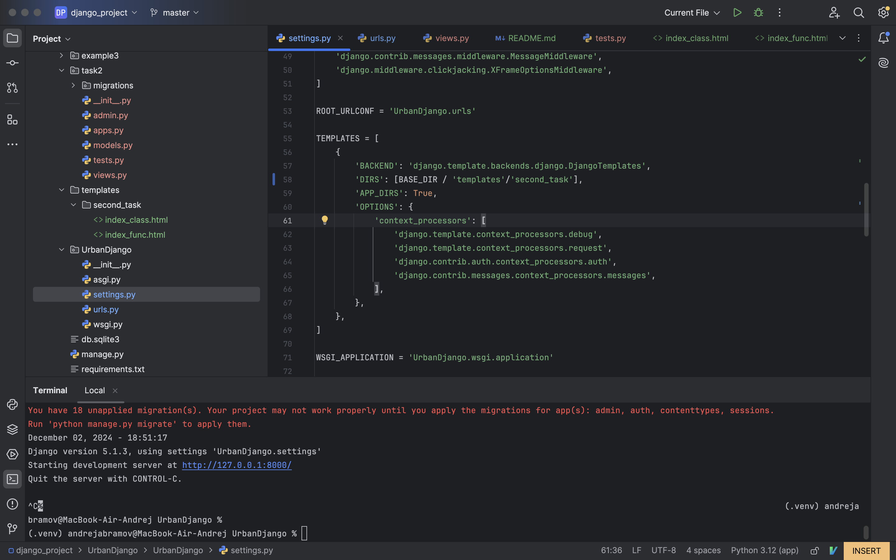
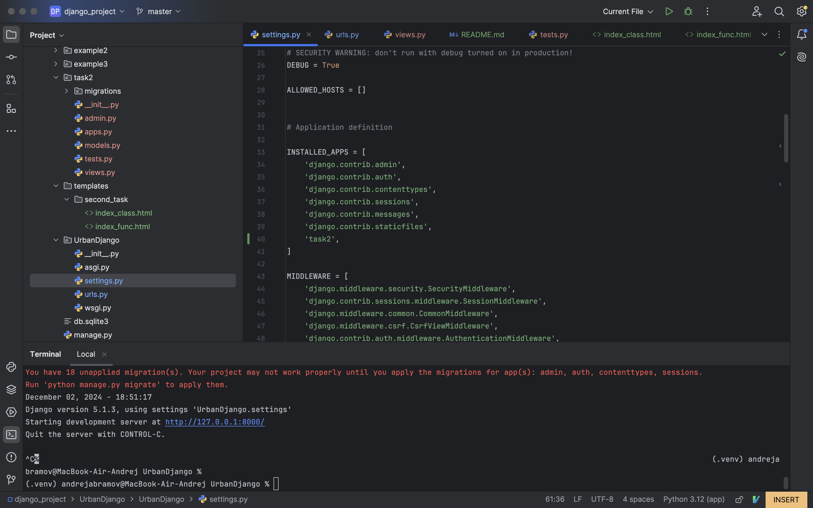
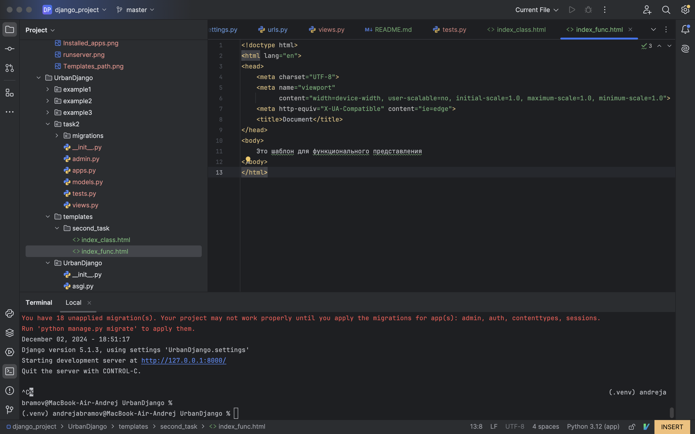
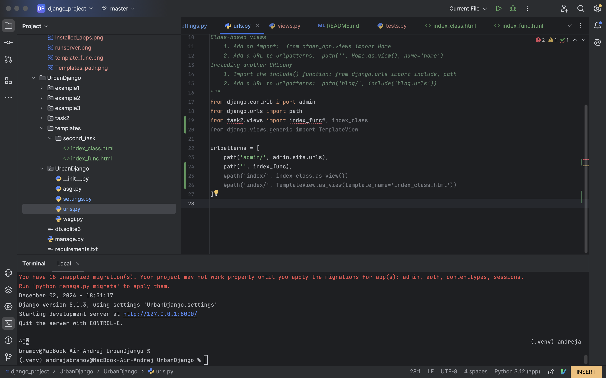
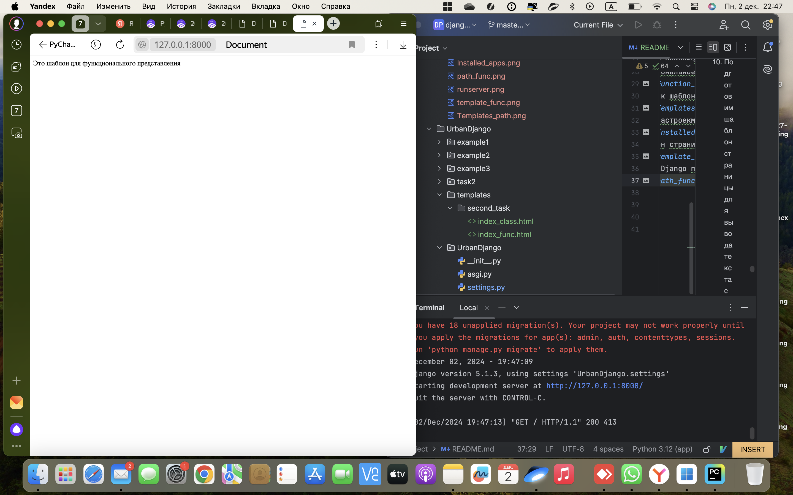
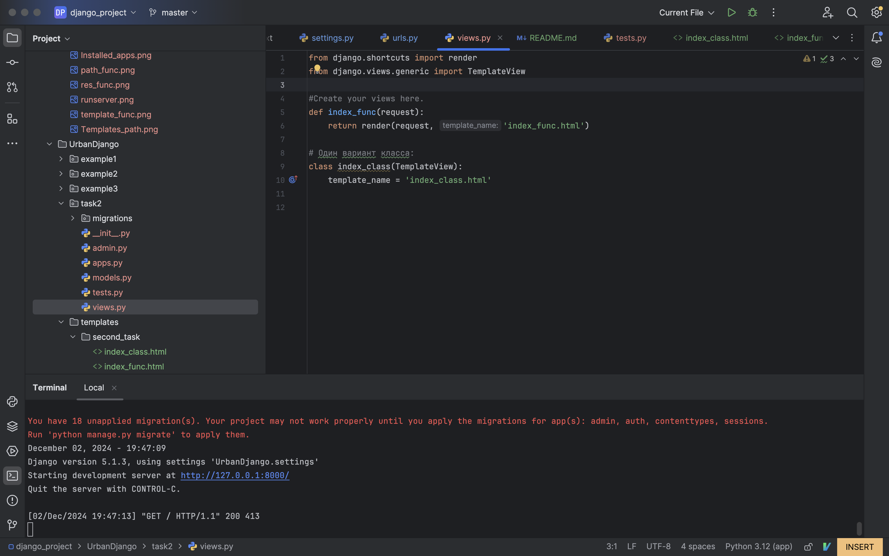
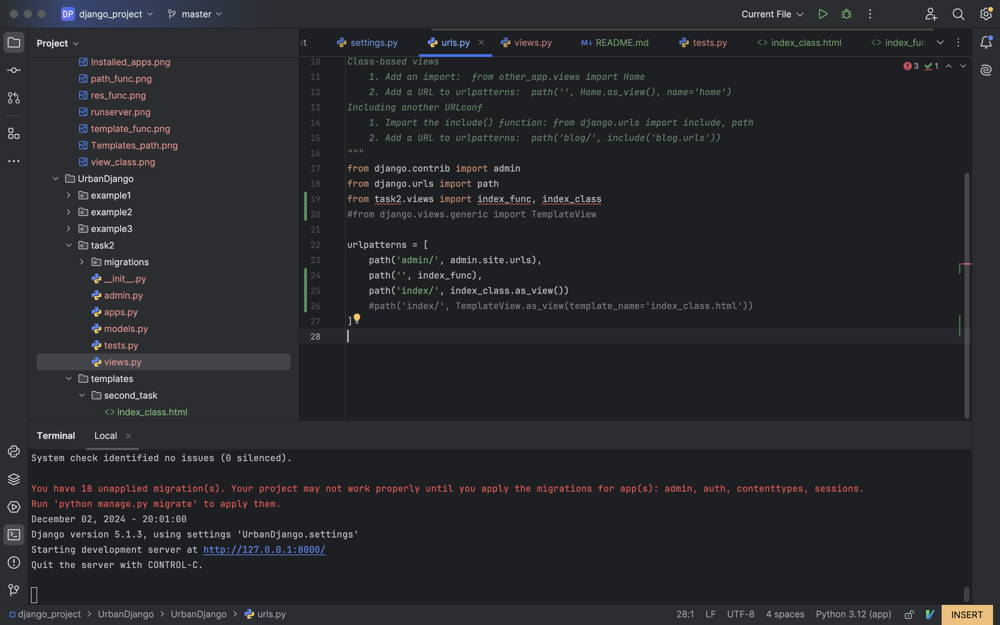
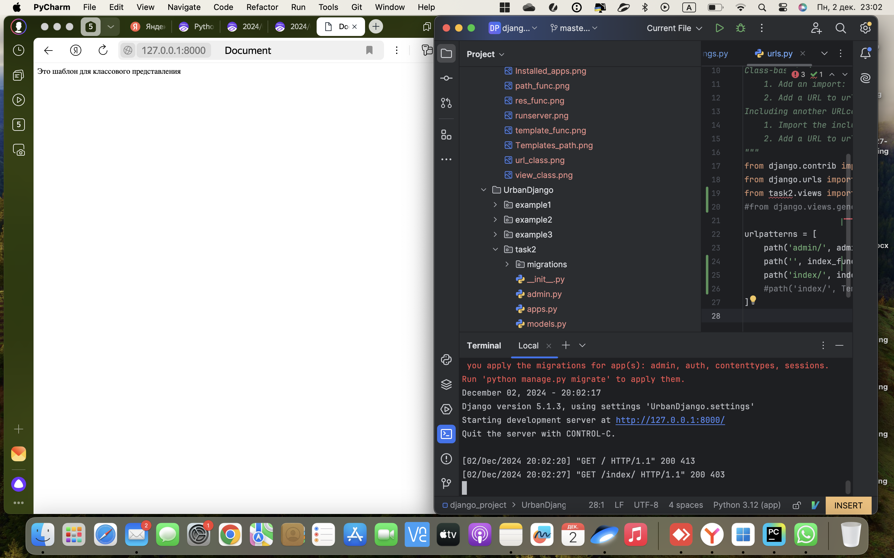

## Домашнее задание по Django проекту:

#### Исполнено Андреем Абрамовым

##  I. Начало
### 
1. Создаем pycharm проект
2. В виртуальное окружение устанавливаем Django:  
```pip install django```
3. Создаем проект Django с именем UrbanDjango:   
```django-admin startproject UrbanDjango``` 
4. Переходим в директорию django проекта:  
```cd UrbanDjango```
5. Запускаем сервер django:  
```python3 manage.py runserver```  
Результат:
  
6. Добавляем приложения в Django проект (UrbanDjango): согласно задания это приложения:
- example1
- example2
- example3
- task2
Проверяем, что находимся в директории UrbanDjango  
```python3 manage.py startapp example1```  
```python3 manage.py startapp example2```  
```python3 manage.py startapp example3```  
```python3 manage.py startapp task2```  
7. Находим в рабочем приложении (по текущему заданию это task2) файл views.py
и настраиваем функциональное представление:  
  
8. Прописываем путь к шаблонам в файле settings.py Django проекта:  
  
9. В этом же файле настроекм в список установленных приложений добавляем наше рабочее:  
  
10. Подготовим шаблон страницы для вывода текста с помощью функционального представления:  
  
11. В файле urls.py Django проекта свяжем url с шаблоном:  
  
12. Запускаем приложение и получаем нужный текст в броузере:  
  
13. Создаем первый вариант классового представления м помощью класса, наследующего TemplateView  
Файл views.py приложения:  
  
Файл urls.py django проекта:  

Результат в броузере:

14. Второй (упрощенный) вариант классового представления:


